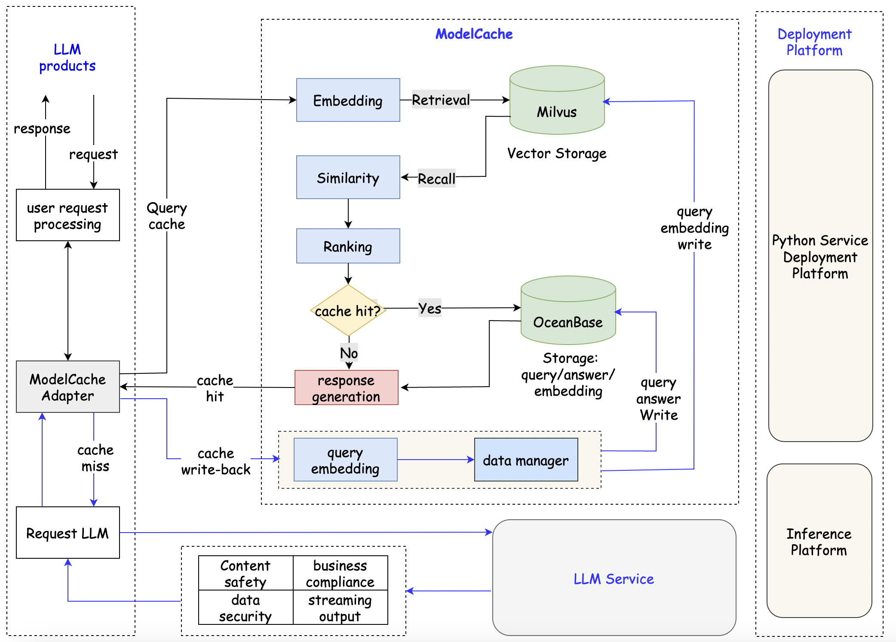

<div align="center">
<h1>
Codefuse-ModelCache
</h1>
</div>

<p align="center">
<div align="center">
<h4 align="center">
    <p>
        <b>中文</b> |
        <a href="https://github.com/codefuse-ai/CodeFuse-ModelCache/blob/main/README.md">English</a>
    </p>
</h4>
</div>

## Contents
- [新闻](#新闻)
- [项目简介](#项目简介)
- [快速部署](#快速部署)
- [服务访问](#服务访问)
- [文章](#文章)
- [架构大图](#架构大图)
- [核心功能](#核心功能)
## 新闻
[2023.11.20] codefuse-ModelCache增加本地存储能力, 适配了嵌入式数据库sqlite、faiss，方便用户快速启动测试。
[2023.10.31] codefuse-ModelCache...
## 项目简介
Codefuse-ModelCache 是一个开源的大模型语义缓存系统，通过缓存已生成的模型结果，降低类似请求的响应时间，提升用户体验。该项目从服务优化角度出发，引入缓存机制，在资源有限和对实时性要求较高的场景下，帮助企业和研究机构降低推理部署成本、提升模型性能和效率、提供规模化大模型服务。我们希望通过开源，分享交流大模型语义Cache的相关技术。
## 快速部署
项目中启动服务脚本分为flask4modelcache.py 和 flask4modelcache_demo.py，其中：

- flask4modelcache_demo.py 为快速测试服务，内嵌了sqlite和faiss，用户无需关心数据库相关事宜。
- flask4modelcache.py 为正常服务，需用户具备mysql和milvus等数据库服务。
### 环境依赖

- python版本: 3.8及以上
- 依赖包安装：
```shell
pip install requirements.txt 
```
### 服务启动
#### Demo服务启动
- 离线模型bin文件下载， 参考地址：[https://huggingface.co/shibing624/text2vec-base-chinese/tree/main](https://huggingface.co/shibing624/text2vec-base-chinese/tree/main)，并将下载的bin文件，放到 model/text2vec-base-chinese 文件夹中。
- 执行flask4modelcache_demo.py脚本即可启动。

#### 正常服务启动
在启动服务前，应该进行如下环境配置：
1. 安装关系数据库 mysql， 导入sql创建数据表，sql文件: reference_doc/create_table.sql
2. 安装向量数据库milvus
3. 在配置文件中添加数据库访问信息，配置文件为：
   1. modelcache/config/milvus_config.ini
   2. modelcache/config/mysql_config.ini
4. 离线模型bin文件下载， 参考地址：[https://huggingface.co/shibing624/text2vec-base-chinese/tree/main](https://huggingface.co/shibing624/text2vec-base-chinese/tree/main)，并将下载的bin文件，放到 model/text2vec-base-chinese 文件夹中
5. 通过flask4modelcache.py脚本启动后端服务。
## 服务访问
当前服务以restful API方式提供3个核心功能：数据写入，cache查询和cache数据清空。请求demo 如下：
### cache写入
```python
import json
import requests
url = 'http://127.0.0.1:5000/modelcache'
type = 'insert'
scope = {"model": "CODEGPT-1008"}
chat_info = [{"query": [{"role": "system", "content": "你是一个AI代码助手, 你必须提供中立的、无害的答案帮助用户解决代码相关的问题"}, {"role": "user", "content": "你是谁?"}],
                  "answer": "你好，我是智能助手，请问有什么能帮您!"}]
data = {'type': type, 'scope': scope, 'chat_info': chat_info}
headers = {"Content-Type": "application/json"}
res = requests.post(url, headers=headers, json=json.dumps(data))
```
### cache查询
```python
import json
import requests
url = 'http://127.0.0.1:5000/modelcache'
type = 'query'
scope = {"model": "CODEGPT-1008"}
query = [{"role": "system", "content": "你是一个AI代码助手, 你必须提供中立的、无害的答案帮助用户解决代码相关的问题"}, {"role": "user", "content": "你是谁?"}]
data = {'type': type, 'scope': scope, 'query': query}

headers = {"Content-Type": "application/json"}
res = requests.post(url, headers=headers, json=json.dumps(data))
```
### cache清空
```python
import json
import requests
url = 'http://127.0.0.1:5000/modelcache'
type = 'remove'
scope = {"model": "CODEGPT-1008"}
remove_type = 'truncate_by_model'
data = {'type': type, 'scope': scope, 'remove_type': remove_type}

headers = {"Content-Type": "application/json"}
res = requests.post(url, headers=headers, json=json.dumps(data))
```
## 文章
https://mp.weixin.qq.com/s/ExIRu2o7yvXa6nNLZcCfhQ
## 架构大图

## 功能对比
功能方面，为了解决huggingface网络问题并提升推理速度，增加了embedding本地推理能力。鉴于SqlAlchemy框架存在一些限制，我们对关系数据库交互模块进行了重写，以更灵活地实现数据库操作。在实践中，大型模型产品需要与多个用户和多个模型对接，因此在ModelCache中增加了对多租户的支持，同时也初步兼容了系统指令和多轮会话。

<table>
  <tr>
    <th rowspan="2">模块</th>
    <th rowspan="2">功能</th>

  </tr>
  <tr>
    <th>ModelCache</th>
    <th>GPTCache</th>
  </tr>
  <tr>
    <td rowspan="2">基础接口</td>
    <td>数据查询接口</td>
    <td class="checkmark">&#9745; </td>
    <td class="checkmark">&#9745; </td>
  </tr>
  <tr>
    <td>数据写入接口</td>
    <td class="checkmark">&#9745; </td>
    <td class="checkmark">&#9745; </td>
  </tr>
  <tr>
    <td rowspan="3">Embedding</td>
    <td>embedding模型配置</td>
    <td class="checkmark">&#9745; </td>
    <td class="checkmark">&#9745; </td>
  </tr>
  <tr>
    <td>大模型embedding层</td>
    <td class="checkmark">&#9745; </td>
    <td></td>
  </tr>
  <tr>
    <td>bert模型长文本处理</td>
    <td class="checkmark">&#9745; </td>
    <td></td>
  </tr>
  <tr>
    <td rowspan="2">Large model invocation</td>
    <td>是否与大模型解耦</td>
    <td class="checkmark">&#9745; </td>
    <td></td>
  </tr>
  <tr>
    <td>embeddingg模型本地加载</td>
    <td class="checkmark">&#9745; </td>
    <td></td>
  </tr>
  <tr>
    <td rowspan="2">数据隔离</td>
    <td>模型数据隔离</td>
    <td class="checkmark">&#9745; </td>
    <td class="checkmark">&#9745; </td>
  </tr>
  <tr>
    <td>超参数隔离</td>
    <td></td>
    <td></td>
  </tr>
  <tr>
    <td rowspan="3">数据库</td>
    <td>MySQL</td>
    <td class="checkmark">&#9745; </td>
    <td class="checkmark">&#9745; </td>
  </tr>
  <tr>
    <td>Milvus</td>
    <td class="checkmark">&#9745; </td>
    <td class="checkmark">&#9745; </td>
  </tr>
  <tr>
    <td>OceanBase</td>
    <td class="checkmark">&#9745; </td>
    <td></td>
  </tr>
  <tr>
    <td rowspan="3">会话管理</td>
    <td>单轮回话</td>
    <td class="checkmark">&#9745; </td>
    <td class="checkmark">&#9745; </td>
  </tr>
  <tr>
    <td>system指令</td>
    <td class="checkmark">&#9745; </td>
    <td></td>
  </tr>
  <tr>
    <td>多轮回话</td>
    <td class="checkmark">&#9745; </td>
    <td></td>
  </tr>
  <tr>
    <td rowspan="2">数据管理</td>
    <td>数据持久化</td>
    <td class="checkmark">&#9745; </td>
    <td class="checkmark">&#9745; </td>
  </tr>
  <tr>
    <td>一键清空缓存</td>
    <td class="checkmark">&#9745; </td>
    <td></td>
  </tr>
  <tr>
    <td rowspan="2">租户管理</td>
    <td>支持多租户（多模型）</td>
    <td class="checkmark">&#9745; </td>
    <td></td>
  </tr>
  <tr>
    <td>milvus多表能力</td>
    <td class="checkmark">&#9745; </td>
    <td></td>
  </tr>
  <tr>
    <td>其他</td>
    <td>长短对话区分能力</td>
    <td class="checkmark">&#9745; </td>
    <td></td>
  </tr>
</table>

## 核心功能
在ModelCache中，沿用了GPTCache的主要思想，包含了一系列核心模块：adapter、embedding、similarity和data_manager。adapter模块主要功能是处理各种任务的业务逻辑，并且能够将embedding、similarity、data_manager等模块串联起来；embedding模块主要负责将文本转换为语义向量表示，它将用户的查询转换为向量形式，并用于后续的召回或存储操作；rank模块用于对召回的向量进行相似度排序和评估；data_manager模块主要用于管理数据库。同时，为了更好的在工业界落地，我们做了架构和功能上的升级，如下：

- [x] 架构调整（轻量化集成）：以类redis的缓存模式嵌入到大模型产品中，提供语义缓存能力，不会干扰LLM调用和安全审核等功能，适配所有大模型服务。
- [x] 多种模型加载方案：
   - 支持加载本地embedding模型，解决huggingface网络连通问题
   - 支持加载多种预训练模型embeding层
- [x] 数据隔离能力
   - 环境隔离：可依据环境，拉取不同的数据库配置，实现环境隔离（开发、预发、生产）
   - 多租户数据隔离：根据模型动态创建collection，进行数据隔离，用于大模型产品中多个模型/服务数据隔离问题
- [x] 支持系统指令：采用拼接的方式，解决propmt范式中sys指令问题。
- [x] 长短文本区分：长文本会给相似评估带来更多挑战，增加了长短文本的区分，可单独配置判断阈值。
- [x] milvus性能优化：milvus consistency_level调整为"Session"级别，可以得到更好的性能。
- [x] 数据管理能力：
   - 一键清空缓存的能力，用于模型升级后的数据管理。
   - 召回hitquery，用于后续的数据分析和模型迭代参考。
   - 异步日志回写能力，用于数据分析和统计
   - 增加model字段和数据统计字段，用于功能拓展。

未来会持续建设的功能：

- [ ] 基于超参数的数据隔离
- [ ] system promt分区存储能力，以提高相似度匹配的准确度和效率
- [ ] 更通用的embedding模型和相似度评估算法
## 致谢
本项目参考了以下开源项目，在此对相关项目和研究开发人员表示感谢。<br />[GPTCache](https://github.com/zilliztech/GPTCache)

