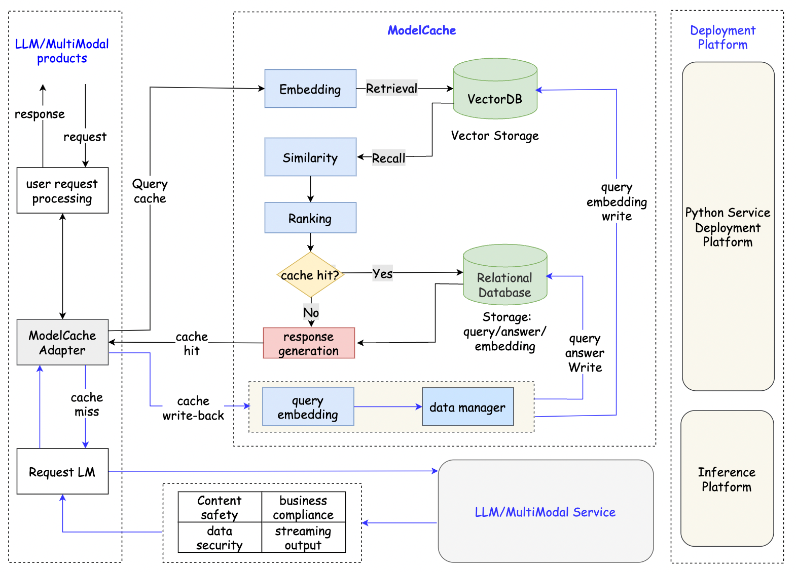

<div align="center">
<h1>
ModelCache
</h1>
</div>

<p align="center">
<div align="center">
<h4 align="center">
    <p>
        <a href="https://github.com/codefuse-ai/CodeFuse-ModelCache/blob/main/README_CN.md">中文</a> |
        <a href="https://github.com/codefuse-ai/CodeFuse-ModelCache/blob/main/README.md">English</a> |
        <b>日本語</b>
    </p>
</h4>
</div>

## 目次

- [目次](#目次)
- [ニュース](#ニュース)
- [プロジェクト概要](#プロジェクト概要)
- [アーキテクチャ](#アーキテクチャ)
- [クイックスタート](#クイックスタート)
  - [依存関係](#依存関係)
  - [サービスの開始](#サービスの開始)
    - [デモの開始](#デモの開始)
    - [通常サービスの開始](#通常サービスの開始)
- [サービスの利用](#サービスの利用)
  - [キャッシュの書き込み](#キャッシュの書き込み)
  - [キャッシュのクエリ](#キャッシュのクエリ)
  - [キャッシュのクリア](#キャッシュのクリア)
- [機能比較](#機能比較)
- [特徴](#特徴)
- [Todoリスト](#todoリスト)
  - [アダプタ](#アダプタ)
  - [埋め込みモデルと推論](#埋め込みモデルと推論)
  - [スカラー ストレージ](#スカラー-ストレージ)
  - [ベクトル ストレージ](#ベクトル-ストレージ)
  - [ランキング](#ランキング)
  - [サービス](#サービス)
- [謝辞](#謝辞)
- [貢献](#貢献)

## ニュース

- 🔥🔥[2024.10.22] 1024プログラマーの日のタスクを追加しました。
- 🔥🔥[2024.04.09] Redis Searchを追加して、マルチテナントで埋め込みを保存および取得できるようにしました。これにより、キャッシュとベクトルデータベース間のインタラクション時間を10msに短縮できます。
- 🔥🔥[2023.12.10] 'llmEmb'、'ONNX'、'PaddleNLP'、'FastText'などのLLM埋め込みフレームワークと、画像埋め込みフレームワーク'timm'を統合して、埋め込み機能を強化しました。
- 🔥🔥[2023.11.20] ローカルストレージ（sqliteおよびfaiss）を統合しました。これにより、迅速かつ便利なテストを開始できます。
- [2023.08.26] codefuse-ModelCache...

### プロジェクト概要

Codefuse-ModelCacheは、大規模言語モデル（LLM）のセマンティックキャッシュです。事前に生成されたモデル結果をキャッシュすることで、類似のリクエストに対する応答時間を短縮し、ユーザーエクスペリエンスを向上させます。<br />このプロジェクトは、キャッシュメカニズムを導入することでサービスを最適化することを目的としています。企業や研究機関が推論展開のコストを削減し、モデルのパフォーマンスと効率を向上させ、大規模モデルのスケーラブルなサービスを提供するのに役立ちます。オープンソースを通じて、大規模モデルのセマンティックキャッシュに関連する技術を共有し、交換することを目指しています。

## アーキテクチャ



## クイックスタート

開始スクリプトは `flask4modelcache.py` と `flask4modelcache_demo.py` にあります。

- `flask4modelcache_demo.py`: SQLiteとFAISSを埋め込んだクイックテストサービス。データベースの設定は不要です。
- `flask4modelcache.py`: MySQLとMilvusの設定が必要な標準サービス。

### 依存関係

- Python: V3.8以上
- パッケージのインストール

  ```shell
  pip install -r requirements.txt 
  ```

### サービスの開始

#### デモの開始

1. 埋め込みモデルのbinファイルを[Hugging Face](https://huggingface.co/shibing624/text2vec-base-chinese/tree/main)からダウンロードします。`model/text2vec-base-chinese`フォルダに配置します。
2. バックエンドサービスを開始します：

  ```shell
  cd CodeFuse-ModelCache
  ```

  ```shell
  python flask4modelcache_demo.py
  ```

#### 通常サービスの開始

標準サービスを開始する前に、次の手順を実行します：

1. MySQLをインストールし、`reference_doc/create_table.sql`からSQLファイルをインポートします。
2. ベクトルデータベースMilvusをインストールします。
3. データベースアクセスを次のファイルに設定します：
   - `modelcache/config/milvus_config.ini`
   - `modelcache/config/mysql_config.ini`
4. 埋め込みモデルのbinファイルを[Hugging Face](https://huggingface.co/shibing624/text2vec-base-chinese/tree/main)からダウンロードします。`model/text2vec-base-chinese`に配置します。
5. バックエンドサービスを開始します：

    ```bash
    python flask4modelcache.py
    ```

## サービスの利用

このサービスは、キャッシュの書き込み、キャッシュのクエリ、およびキャッシュのクリアという3つの主要なRESTful API機能を提供します。

### キャッシュの書き込み

```python
import json
import requests
url = 'http://127.0.0.1:5000/modelcache'
type = 'insert'
scope = {"model": "CODEGPT-1008"}
chat_info = [{"query": [{"role": "system", "content": "あなたはAIコードアシスタントであり、ユーザーがコード関連の問題を解決するのを助けるために中立で無害な回答を提供する必要があります。"}, {"role": "user", "content": "あなたは誰ですか?"}],
                  "answer": "こんにちは、私はインテリジェントアシスタントです。どのようにお手伝いできますか？"}]
data = {'type': type, 'scope': scope, 'chat_info': chat_info}
headers = {"Content-Type": "application/json"}
res = requests.post(url, headers=headers, json=json.dumps(data))
```

### キャッシュのクエリ

```python
import json
import requests
url = 'http://127.0.0.1:5000/modelcache'
type = 'query'
scope = {"model": "CODEGPT-1008"}
query = [{"role": "system", "content": "あなたはAIコードアシスタントであり、ユーザーがコード関連の問題を解決するのを助けるために中立で無害な回答を提供する必要があります。"}, {"role": "user", "content": "あなたは誰ですか?"}]
data = {'type': type, 'scope': scope, 'query': query}

headers = {"Content-Type": "application/json"}
res = requests.post(url, headers=headers, json=json.dumps(data))
```

### キャッシュのクリア

```python
import json
import requests
url = 'http://127.0.0.1:5000/modelcache'
type = 'remove'
scope = {"model": "CODEGPT-1008"}
remove_type = 'truncate_by_model'
data = {'type': type, 'scope': scope, 'remove_type': remove_type}

headers = {"Content-Type": "application/json"}
res = requests.post(url, headers=headers, json=json.dumps(data))
```

## 機能比較

Hugging Faceのネットワーク問題を解決し、推論速度を向上させるために、ローカル埋め込み機能を導入しました。SqlAlchemyの制限により、関係データベースのインタラクションモジュールを再設計し、より柔軟な操作を実現しました。LLM製品における複数のユーザーとモデルの必要性を認識し、ModelCacheにマルチテナンシーサポートを追加しました。最後に、システムコマンドとマルチターンダイアログとの互換性を向上させるための初期調整を行いました。

<table>
  <tr>
    <th rowspan="2">モジュール</th>
    <th rowspan="2">機能</th>

  </tr>
  <tr>
    <th>ModelCache</th>
    <th>GPTCache</th>
  </tr>
  <tr>
    <td rowspan="2">基本インターフェース</td>
    <td>データクエリインターフェース</td>
    <td class="checkmark">&#9745; </td>
    <td class="checkmark">&#9745; </td>
  </tr>
  <tr>
    <td>データ書き込みインターフェース</td>
    <td class="checkmark">&#9745; </td>
    <td class="checkmark">&#9745; </td>
  </tr>
  <tr>
    <td rowspan="3">埋め込み</td>
    <td>埋め込みモデルの設定</td>
    <td class="checkmark">&#9745; </td>
    <td class="checkmark">&#9745; </td>
  </tr>
  <tr>
    <td>大規模モデルの埋め込み層</td>
    <td class="checkmark">&#9745; </td>
    <td></td>
  </tr>
  <tr>
    <td>BERTモデルの長文処理</td>
    <td class="checkmark">&#9745; </td>
    <td></td>
  </tr>
  <tr>
    <td rowspan="2">大規模モデルの呼び出し</td>
    <td>大規模モデルからのデカップリング</td>
    <td class="checkmark">&#9745; </td>
    <td></td>
  </tr>
  <tr>
    <td>埋め込みモデルのローカル読み込み</td>
    <td class="checkmark">&#9745; </td>
    <td></td>
  </tr>
  <tr>
    <td rowspan="2">データの分離</td>
    <td>モデルデータの分離</td>
    <td class="checkmark">&#9745; </td>
    <td class="checkmark">&#9745; </td>
  </tr>
  <tr>
    <td>ハイパーパラメータの分離</td>
    <td></td>
    <td></td>
  </tr>
  <tr>
    <td rowspan="3">データベース</td>
    <td>MySQL</td>
    <td class="checkmark">&#9745; </td>
    <td class="checkmark">&#9745; </td>
  </tr>
  <tr>
    <td>Milvus</td>
    <td class="checkmark">&#9745; </td>
    <td class="checkmark">&#9745; </td>
  </tr>
  <tr>
    <td>OceanBase</td>
    <td class="checkmark">&#9745; </td>
    <td></td>
  </tr>
  <tr>
    <td rowspan="3">セッション管理</td>
    <td>シングルターンダイアログ</td>
    <td class="checkmark">&#9745; </td>
    <td class="checkmark">&#9745; </td>
  </tr>
  <tr>
    <td>システムコマンド</td>
    <td class="checkmark">&#9745; </td>
    <td></td>
  </tr>
  <tr>
    <td>マルチターンダイアログ</td>
    <td class="checkmark">&#9745; </td>
    <td></td>
  </tr>
  <tr>
    <td rowspan="2">データ管理</td>
    <td>データの永続化</td>
    <td class="checkmark">&#9745; </td>
    <td class="checkmark">&#9745; </td>
  </tr>
  <tr>
    <td>ワンクリックでキャッシュをクリア</td>
    <td class="checkmark">&#9745; </td>
    <td></td>
  </tr>
  <tr>
    <td rowspan="2">テナント管理</td>
    <td>マルチテナンシーのサポート</td>
    <td class="checkmark">&#9745; </td>
    <td></td>
  </tr>
  <tr>
    <td>Milvusのマルチコレクション機能</td>
    <td class="checkmark">&#9745; </td>
    <td></td>
  </tr>
  <tr>
    <td>その他</td>
    <td>長短ダイアログの区別</td>
    <td class="checkmark">&#9745; </td>
    <td></td>
  </tr>
</table>

## 特徴

ModelCacheでは、GPTCacheのコア原則を取り入れました。ModelCacheには、アダプタ、埋め込み、類似性、およびデータマネージャの4つのモジュールがあります。

- アダプタモジュールは、さまざまなタスクのビジネスロジックを調整し、埋め込み、類似性、およびデータマネージャモジュールを統合します。
- 埋め込みモジュールは、テキストをセマンティックベクトル表現に変換し、ユーザーのクエリをベクトルに変換します。
- ランクモジュールは、召喚されたベクトルの類似性を評価します。
- データマネージャモジュールは、データベースを管理します。

ModelCacheを産業用途により適したものにするために、アーキテクチャと機能にいくつかの改善を加えました：

- [x] アーキテクチャの調整（軽量統合）：
  - Redisのようなキャッシュモードを使用してLLM製品に埋め込みました。
  - LLM呼び出し、セキュリティ監査、その他の機能に干渉せずにセマンティックキャッシュを提供しました。
  - すべてのLLMサービスと互換性があります。
- [x] 複数のモデルの読み込み：
  - ローカル埋め込みモデルの読み込みをサポートし、Hugging Faceのネットワーク接続問題を解決しました。
  - さまざまな事前トレーニングモデルの埋め込み層の読み込みをサポートしました。
- [x] データの分離
  - 環境の分離：環境に基づいて異なるデータベース構成を読み取り、開発、ステージング、および本番環境を分離します。
  - マルチテナントデータの分離：モデルに基づいてコレクションを動的に作成し、データを分離します。これにより、大規模言語モデル製品内の複数のモデル/サービスシナリオでのデータ分離の問題に対処します。
- [x] システム指示のサポート：プロンプトパラダイムのシステム指示の問題を解決するために連結アプローチを採用しました。
- [x] 長文と短文の区別：長文は類似性評価に多くの課題をもたらします。長文と短文の区別を追加し、個別のしきい値設定を可能にしました。
- [x] Milvusのパフォーマンス最適化：Milvusの一貫性レベルを「セッション」レベルに調整し、より良いパフォーマンスを実現しました。
- [x] データ管理：
  - モデルのアップグレード後のデータ管理を容易にするためのワンクリックキャッシュクリア。
  - 後続のデータ分析とモデルの反復参照のためのヒットクエリのリコール。
  - データ分析と統計のための非同期ログ書き戻し。
  - 機能を強化するためのモデルフィールドとデータ統計フィールドを追加しました。

## Todoリスト

### アダプタ

- [ ] Milvusのアダプタを登録：スコープ内の「モデル」パラメータに基づいて、対応するコレクションを初期化し、ロード操作を実行します。

### 埋め込みモデルと推論

- [ ] 推論の最適化：埋め込み推論の速度を最適化し、FasterTransformer、TurboTransformers、ByteTransformerなどの推論エンジンに対応します。
- [ ] Hugging FaceモデルとModelScopeモデルとの互換性を持たせ、モデルの読み込み方法を増やします。

### スカラー ストレージ

- [ ] MongoDBのサポート。
- [ ] ElasticSearchのサポート。

### ベクトル ストレージ

- [ ] マルチモーダルシナリオでのFaissストレージの適応。

### ランキング

- [ ] 埋め込み召喚後のデータの順序を精緻化するためのランキングモデルを追加。

### サービス

- [ ] FastAPIのサポート。
- [ ] テスト用のビジュアルインターフェースを追加。

## 謝辞

このプロジェクトは、以下のオープンソースプロジェクトを参考にしています。これらのプロジェクトとその開発者に感謝の意を表します。<br />[GPTCache](https://github.com/zilliztech/GPTCache)

## 貢献

ModelCacheは魅力的で価値のあるプロジェクトです。経験豊富な開発者であれ、初心者であれ、このプロジェクトへの貢献を歓迎します。問題の提起、提案の提供、コードの記述、ドキュメントの作成、例の作成など、あなたの関与はプロジェクトの品質を向上させ、オープンソースコミュニティに大きな貢献をもたらします。
