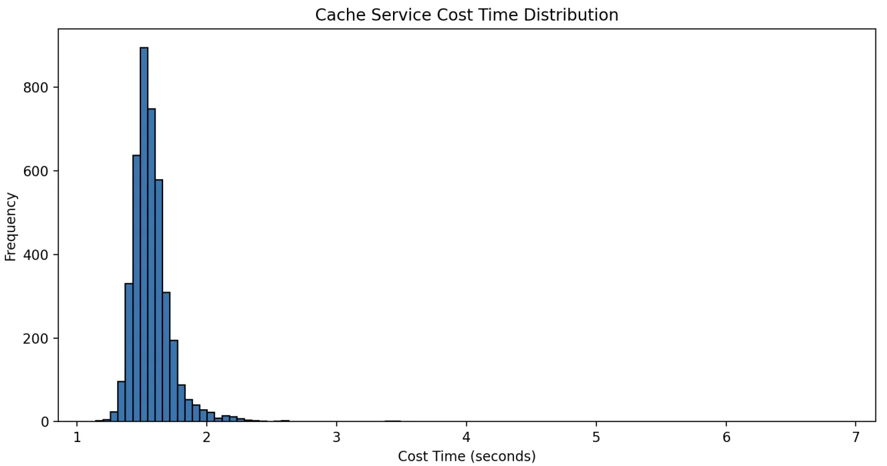
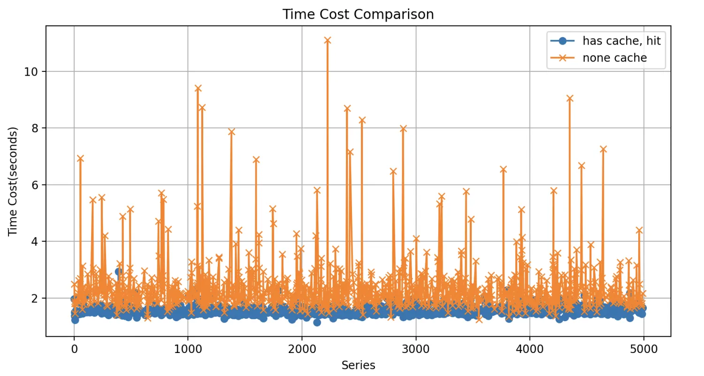

# MultiModal Cache

为满足多模态的性能要求，我们在 LLModel Cache 的基础上，开发了 MultiModal Cache 系统。MultiModal Cache 增强了 ModelCache 功能，架优化架构，适应多种应用场景。

- [MultiModal Cache](#multimodal-cache)
  - [最新动态](#最新动态)
  - [特性](#特性)
  - [性能](#性能)
  - [效果评估](#效果评估)
  - [参与贡献](#参与贡献)

## 最新动态

- [2024.12.12] MultiModal Cache 系统正式发布。

## 特性

| 场景 | 数据类型 | 图像格式 | 数据隔离 |
|------|----------|----------|----------|
| 文本对话 | 文本 | 不适用 | 支持 |
| 图文理解 | 文本+图像 | image_url/image_base64 | 支持 |

- **兼容性**：支持文本和图片链接（image_url）和图片 Base64 编码三种数据格式及其组合。
- **数据隔离**：支持多模型数据隔离，允许不同数据模型在同一系统中独立运行。
- **模态隔离**：支持同一模型下不同模态数据（如文本和图像）的隔离处理。

## 性能

我们在生产环境中使用企业级数据库对 MultiModal Cache 进行了全面的性能评估。以下是详细的性能数据：

<table cellpadding="5" cellspacing="0" style="border-collapse: collapse;">
  <tr style="background-color: #B8D4FF;">
    <th>请求类型</th>
    <th>Cache Hit</th>
    <th>总耗时范围</th>
    <th>组件</th>
    <th>组件耗时</th>
  </tr>
  <tr style="background-color: #F2F2F2;">
    <td rowspan="6">Text</td>
    <td rowspan="3">Hit</td>
    <td rowspan="3">420ms-520ms</td>
    <td>Multi-Encoder (Text):</td>
    <td>~300ms</td>
  </tr>
  <tr style="background-color: #F2F2F2;">
    <td>向量存储检索</td>
    <td>40-50ms</td>
  </tr>
  <tr style="background-color: #F2F2F2;">
    <td>关系存储检索</td>
    <td>60-70ms</td>
  </tr>
  <tr>
    <td rowspan="3">Not Hit</td>
    <td rowspan="3">300ms+N(s)</td>
    <td>Multi-Encoder (Text):</td>
    <td>~300ms</td>
  </tr>
  <tr>
    <td>向量存储检索</td>
    <td>40-50ms</td>
  </tr>
  <tr>
    <td>大模型调用</td>
    <td>N (s)</td>
  </tr>
  <tr style="background-color: #F2F2F2;">
    <td rowspan="6">IMG_TEXT</td>
    <td rowspan="3">Hit</td>
    <td rowspan="3">600ms-800ms</td>
    <td>Multi-Encoder (image+text)</td>
    <td>~600ms</td>
  </tr>
  <tr style="background-color: #F2F2F2;">
    <td>向量存储检索</td>
    <td>40-50ms</td>
  </tr>
  <tr style="background-color: #F2F2F2;">
    <td>关系存储检索</td>
    <td>60-70ms</td>
  </tr>
  <tr>
    <td rowspan="3">Not Hit</td>
    <td rowspan="3">600ms+N(s)</td>
    <td>Multi-Encoder (image+text)</td>
    <td>~600ms</td>
  </tr>
  <tr>
    <td>向量存储检索</td>
    <td>40-50ms</td>
  </tr>
  <tr>
    <td>大模型调用</td>
    <td>N (s)</td>
  </tr>
</table>

根据目前的评估结果，Embedding 的推理时间存在较大的优化空间。
**说明**：使用嵌入式数据库可能会进一步提升性能。

## 效果评估

为全面评估 Cache 对模型服务的影响，我们进行了端到端的性能测试，ua 比较了有 Cache 和无 Cache 两种服务配置。我们使用了 5000 个测试用例的数据集进行自动化测试。

- 有 Cache 的预发模型服务：观察其响应时间，预期 Cache 的引入能够显著提升服务的性能，降低延迟。
- 无 Cache 的线上模型服务，以获取其原始性能指标和输出结果。这些数据将作为对比基准。

为了确保 Cache 引入后的数据准确性和一致性，我们比较了两个服务返回的结果，验证了 Cache 机制是否会影响最终用户收到的回复内容。

与原始的直接模型调用方式相比，Cache Service 的调用耗时数据呈现出稳定的分布特征，性能上并不会随着模型参数规模的增加而受到影响。在传统情况下，随着模型参数规模的扩大，模型调用的耗时往往会上升，这是因为更大规模的模型需要更多的计算资源。Cache 服务通过存储经常访问的数据来避免重复的计算，从而一定程度上解耦了耗时与模型复杂性之间的关联。

我们对缓存命中的耗时与实际调用模型的耗时进行了对比分析。实验数据表明，在集成  Cache Service之后，基于 llama7B 模型，缓存命中所带来的性能提升超过了 40%。预计随着模型的持续迭代与优化，性能提升的幅度将会有更进一步的增长。

## 参与贡献

MultiModal Cache 是一个充满潜力的开源项目，我们欢迎各种形式的贡献：

- 提交问题和建议
- 参与代码编写
- 完善文档和示例

无论您是经验丰富的开发者还是新手，您的参与都将使这个项目更加出色，同时为开源社区做出贡献。
